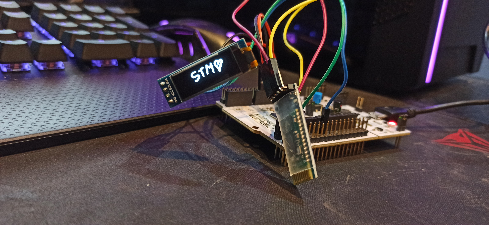
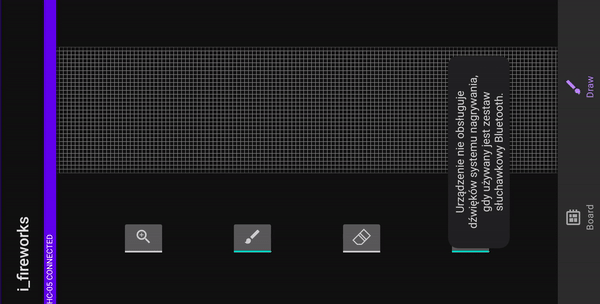
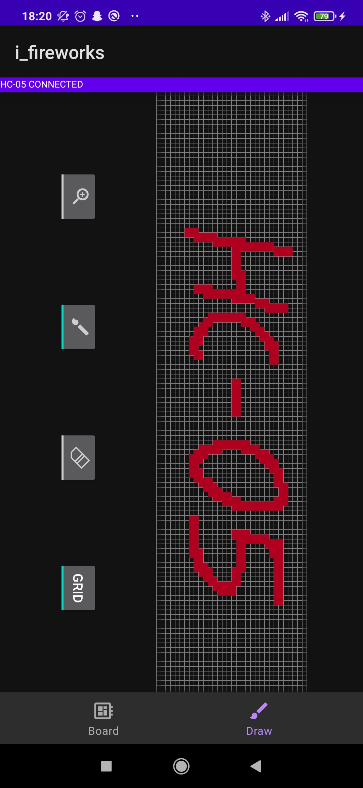

Connect STM32 board with BT module, and an OLED screen together. Communicate with an Android APP, AND DRAW PICTURES!

STM PROJECT INCLUDES DMA DATA PROCESSING.

App stuttering cause of screen recorder.

In-app screen:

